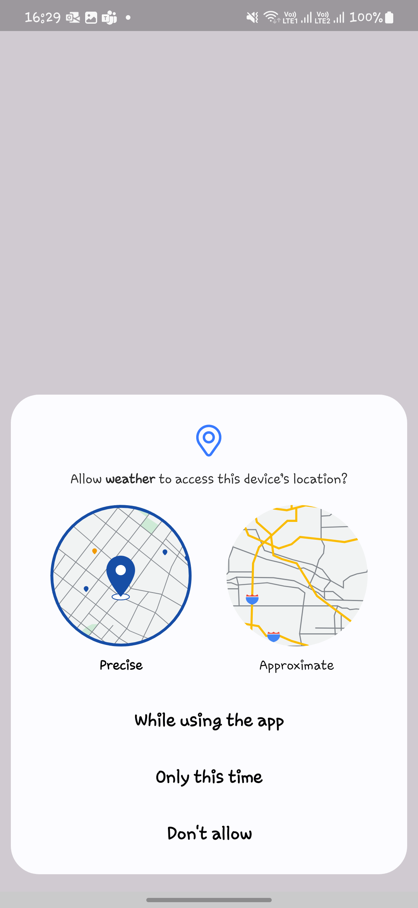
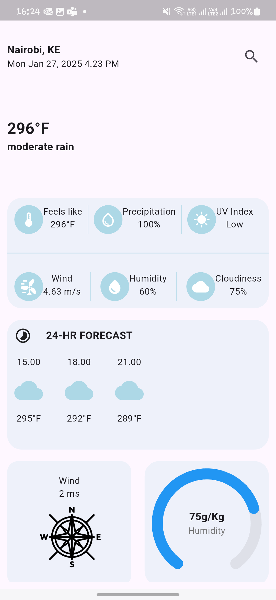
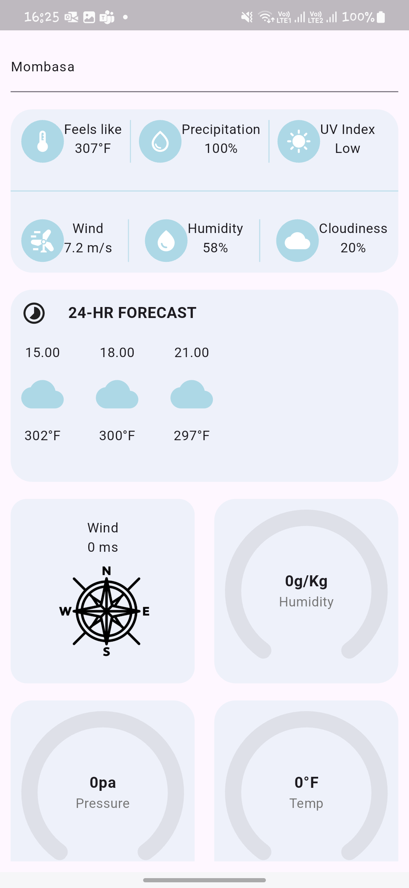

## Craft Silicon Limited Interview Solution

👀  Solution code for the weather app for crossplatform using [flutter](https://flutter.dev/).
The final app looks like this:

#### Screens
| Location permission                      | Current location date               | Searched location date                 |                        |
|------------------------------------------|-------------------------------------|----------------------------------------|------------------------|
|  |  |  |                        |

### Prerequisites

- Before running this app, you need to have java 19 installed:

- Ensure the minimum sdk set above 21 and multiDexEnabled set to true on app/build.gradle:

```shell script
    defaultConfig {
        minSdk = 23
        multiDexEnabled true
    }
```
- Ensure the compile sdk is set to 34:
```shell script
    android {
    compileSdk = 34
```
- On the lib/app folder, add a package constants and a class constants and add the `apikey` and the `googleApiKey` as a static const.
- Once the project is set up, run:
```shell script
    flutter pub get
```

### Background
Develop a mobile application using Flutter (Dart)/Native Android (Java/Kotlin) / Native  iOS (Swift) that fetches and displays weather data from the OpenWeather API. The app should showcase good UI/UX design and handle data fetching and offline storage
effectively.
#### Core features
##### 1. App Overview:
The app should display the current weather and a 5-day forecast for a selected
city.
- Users should be able to search for a city and view its weather details.
- The app should show a loading indicator while fetching data from the API.

##### 2. UI/UX:
The app should have a clean, modern, and user-friendly design.
- Use appropriate icons, typography, and color schemes to enhance the user experience.
- Ensure the app is responsive and works well on different screen sizes.

##### 3. API Integration:
Fetch weather data from the OpenWeather API.
- Use appropriate API endpoints to get current weather and forecast data.

##### 4. Offline Support:
Implement offline storage to save the weather data locally.
- Display cached weather data when the app is offline.
- Indicate to the user when the data was last updated.

##### 5. Error Handling:
- Handle possible errors such as network issues or API errors gracefully.
- Display user-friendly error messages.

## Tech-stack

* Framework
    * [Flutter](https://flutter.dev/) - a cross-platform, statically typed, general-purpose programming language with type inference.

* State management
    * [Getx](https://chornthorn.github.io/getx-docs/) - For state management, navigation, and dependency injection.

* SQlite
    * [Sqlite](https://docs.flutter.dev/cookbook/persistence/sqlite) - For offline caching of data
## Dependencies

All the dependencies (external libraries) are defined in the single place - pubspec.yaml.

## License
```
MIT License

Copyright (c) 2025 Juma Paul

Permission is hereby granted, free of charge, to any person obtaining a copy of this software and
associated documentation files (the "Software"), to deal in the Software without restriction, including
without limitation the rights to use, copy, modify, merge, publish, distribute, sublicense, and/or sell
copies of the Software, and to permit persons to whom the Software is furnished to do so, subject to
the following conditions:

The above copyright notice and this permission notice shall be included in all copies or substantial
portions of the Software.

THE SOFTWARE IS PROVIDED "AS IS", WITHOUT WARRANTY OF ANY KIND, EXPRESS OR IMPLIED, INCLUDING BUT NOT
LIMITED TO THE WARRANTIES OF MERCHANTABILITY, FITNESS FOR A PARTICULAR PURPOSE AND NONINFRINGEMENT. IN
NO EVENT SHALL THE AUTHORS OR COPYRIGHT HOLDERS BE LIABLE FOR ANY CLAIM, DAMAGES OR OTHER LIABILITY,
WHETHER IN AN ACTION OF  TORT OR OTHERWISE, ARISING FROM, OUT OF OR IN CONNECTION WITH THE
SOFTWARE OR THE USE OR OTHER DEALINGS IN THE SOFTWARE.
```
